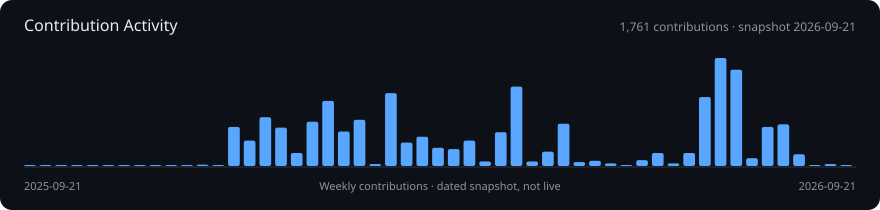

# Junhyeok Ahn

I build with AI and focus on turning working features into **reliable user experiences**.
I'm an Industrial Engineering student at Hanyang University, exploring product quality, onboarding, and dependable AI workflows.

[LinkedIn](https://www.linkedin.com/in/junhyeok-ahn/) · [Email](mailto:ajunh7@gmail.com)

## Selected Work

| Project | Problem & approach | Evidence |
| --- | --- | --- |
| [Scripture Memory](https://github.com/quantsquirrel/scripture-memory) | A local-first PWA for accurate recall and long-term review. Covers content integrity, learning stages, offline use, and backup. | [Product & quality](https://github.com/quantsquirrel/scripture-memory#product--quality) · [App](https://quantsquirrel.github.io/scripture-memory/) |
| [Synod](https://github.com/quantsquirrel/claude-synod-debate) | Multi-model deliberation that makes disagreement inspectable. Emphasizes verifiable evidence and dissent rather than taking model confidence at face value. | [Design changes & limits](https://github.com/quantsquirrel/claude-synod-debate/blob/main/README.md) |
| [Handoff Baton](https://github.com/quantsquirrel/claude-handoff-baton) | Structured handoffs that carry decisions, failed approaches, constraints, and next steps across AI sessions. | [Workflow & evidence](https://github.com/quantsquirrel/claude-handoff-baton/blob/main/README.md) |

## How I Work

- **Start with the problem and acceptance criteria.** Describe expected behavior and failure conditions before implementation.
- **Build with AI, then verify the result.** Separate an agent's completion report from observed evidence.
- **Leave a usable handoff.** Record failed approaches, decision rationale, and unresolved work so the next person can continue.

These projects document implementation and verification. User outcomes and adoption require separate evidence; each project distinguishes demonstrated behavior from unverified claims.

## Additional Work

- [JEDAERO](https://github.com/quantsquirrel/jedaero): a simulation-based investment training MVP for military-service constraints. [Product-operations case study](https://github.com/quantsquirrel/jedaero/blob/main/docs/PRODUCT-OPS-CASE-STUDY.md): improving an AI briefing without giving the model calculation authority.
- [Codex Ultracode Effort](https://github.com/quantsquirrel/codex-ultracode-effort): a prompt-based workflow for ownership, evidence, and adversarial verification, not a standalone execution orchestrator.

Tech Stack & Contribution Activity

## 🛠️ Tech Stack

---

## 📈 Contribution Activity

GitHub activity snapshot captured on 2026-09-21, not a live chart. Contribution counts are not product outcomes or a measure of individual implementation effort.

The [original external graph link](https://github-readme-activity-graph.vercel.app/graph?username=quantsquirrel&theme=tokyo-night&hide_border=true&bg_color=0D1117) is preserved; availability depends on its external service.

---

## 🐍 Contribution Snake

Profile history

The [original README before this update](docs/archive/README-before-product-ops-2026-09-21.md) is preserved unchanged. This page is the current introduction.

